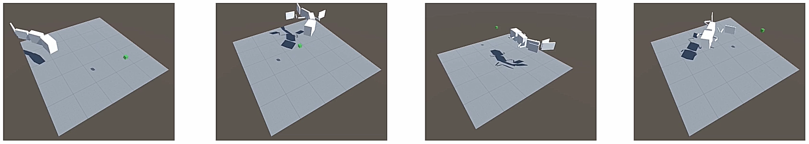

[](https://youtu.be/2-Y8vzH2t5g)

# Learning in Growing Robots: Knowledge Transfer from Tadpole to Frog Robot

This is a part of an ongoing project exploring the relation between varying structure and learning. We use the growing process from a tadpole to a frog as the model. The task is to swim to a randomly generated target position. Between different growing stages, weights of both the policy and value networks are directly transferred. In this way, better parameter initialization provides an initial performance boost and accelerates convergence. It is interesting to see that transfer learning is beneficial even with robots with different structures.

Preliminary results can be found in [Learning in Growing Robots: Knowledge Transfer from Tadpole to Frog Robot](https://link.springer.com/chapter/10.1007/978-3-030-24741-6_42) 

# Installation

This is only tested in Windows 10.

- Install Unity (Simulation Engine)

Unity 2017.4.1 (version is important): https://unity3d.com/get-unity/download/archive

- Install Anaconda (Python)

Python 3.6.8 (Anaconda 4.5.12): https://www.anaconda.com/distribution/

Please remember to add Anaconda to the `PATH` environment variable.

- Install Tensorflow (Neural Network)

Open Anaconda Prompt and type

```
conda create -n growvenv python=3.6
activate growvenv
pip install tensorflow==1.7.1
```

- Install ML-Agents Toolkit (Reinforcement Learning)

Make sure the virtual environment `growvenv` is activated.

```
git clone https://github.com/Unity-Technologies/ml-agents.git
cd ml-agents
pip install -e .
```

# Simulation Setup

- Open Unity and click "New". Name your project, select "3D" Template, and click "create project".

- Open "Edit==>Project Settings==>Player". Under "Other Settings==>Configuration==>Scripting Runtime Version", change "Stable (.NET 3.5 Equivalent)" to "Experimental (.NET 4.6 Equivalent)" and confirm "Restart".

- Choose "Assets==>Import Package==>Custom Package..." then navigate and open "froglet.unitypackage". With all items selected, click "Import".

- In "Project==>Assets==>Scenes", open "froglet".

Now the simulation is ready to run.

